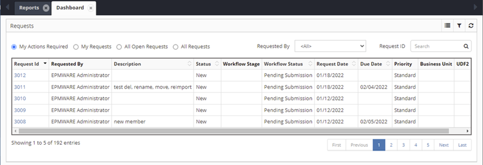
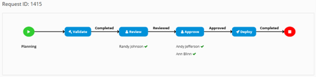
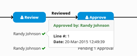
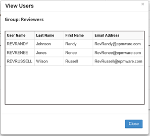
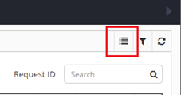
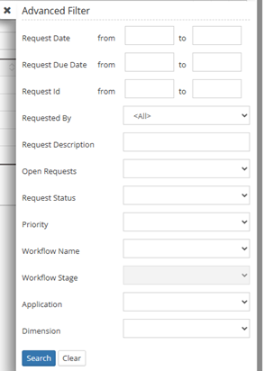

# Dashboard

The **Dashboard** displays all pending requests and the details of the requests in one summary view. It also graphically displays each stage of the **Workflow** and its status as well as the **Reviewers** and **Approvers** of the **Request**.

The top of the **Dashboard** page lists all **Requests** or specific requests that are awaiting actions by selecting one of the radio button filters. Or the user can select **Advanced Filter** to perform a more specific search.

If the **Workflow Status** column has **Pending Actions**, the hyperlink in the **Pending Actions From** column will display the available Approvers or Reviewers. Search for an individual Request by inputting the Request Id in the Search box.

Dashboard main view showing pending requests and workflow status

## Workflow Visualization

Click on a row in the grid to display a graphical view of a request's Workflow status. The graphical view will display each **Workflow Stage** of the **Request**. Under each **Stage** a list of all the **Approvers** by application will be displayed.

  
Detailed workflow stage with approval status

!!! note
    *Pending 1 Approval* will display instead of the **Approver's** name if the Approval is pending.

Clicking on the check mark will display a popup that indicates the date and time it was approved.

 
*Approval timestamp popup*

## Viewing Eligible Approvers

Click on the hyperlink in the **Pending Actions From** column to display the Users that are eligible to Review or Approve the Request.

 
*List of users eligible to approve or review*

All **Approvals** must be completed for the current stage before the **Workflow** can move to the next stage. Once a stage is completed, **Reviewed, Approved, Validated or Deployed** will display in bold above the arrow signifying the stage is complete.

## Mass Approval

Multiple Requests can be selected for Approval or Review by clicking the **Mass Approve** icon.

 
*Mass approval interface*

## Advanced Filter

Narrow Dashboard Requests Displayed by selecting filters:

 
*Advanced filter options for refining request display*

### Filter Options

The Advanced Filter allows you to narrow down the displayed requests using the following criteria:

- **Request Status**: Filter by Open, Pending, Deployed, or Completed
- **Priority**: High, Medium, Low priority requests
- **Workflow**: Filter by specific workflow types
- **Date Range**: Specify start and end dates
- **Requestor**: Filter by specific users
- **Applications**: Show requests for specific applications

---

## Related Topics

- [Creating Metadata Requests](../metadata-requests/index.md)
- [Deployment Monitoring](../deployment/index.md)
- [User Actions Reference](../metadata-requests/index.md)