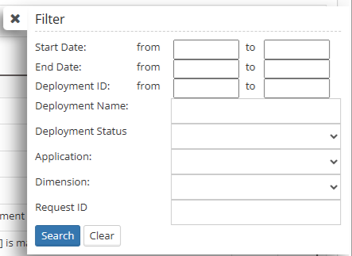

# Deployment

The **Deployment** module centrally manages metadata deployments using the EPMware deployment system. It manages how and when metadata requests are deployed, allowing you to load metadata on demand or schedule a batch to run during off hours. Deployment metrics for all your EPM applications are displayed on one page, and you can monitor in real time as "one time" or batches are deployed to their respective target applications.

The **Monitor Tab** displays each Deployment instance that is generated based on the Deployments defined on the **Deployment Manager** tab. Create a recurring calendar for daily, weekly or monthly metadata deployments and monitor deployment progress with comprehensive status tracking.

 
*Deployment monitor interface showing deployment instances and status*

## Monitor Tab

The grid will display each Deployment instance that is generated based on the Deployments defined on the **Deployment Manager** tab. To redeploy a deployment that has a status of **Failed** or **Partial** in the **Status** column, right click on the row and select **Redeploy.** This will place all un-deployed requests back in the pool for the next scheduled deployment.

To redeploy an individual **Request**, click on the **Deployment ID** to display the **Deployment Status** popup then right click on a row and select **Redeploy**. The redeployment for the individual Request will run on the next scheduled Deployment.

### Monitor Grid

- **Deployment Id -** Unique ID assigned to the Deployment.
- **Name -** Name of Deployment as defined on Manager Tab.
- **Application --** Application being deployed
- **Start Time -** The date and time that the Deployment instance began running.
- **End Time -** The date and time that the Deployment instance completed.
- **Status -** Will display either **Running** or **Completed**
- **Message --** Deployment progress messages
- **Files --** Click to download the deployment files
- **Log -** Will display the log file pertaining to this deployment instance.

## Grid Filter and Auto Refresh

The Filter icon will display the Grid Filter popup and the Auto Refresh icon will toggle Auto Refresh on and off.

 
*Grid filter dialog for narrowing deployment results*

 
*Auto refresh toggle for real-time monitoring*

The Grid Filter allows you to narrow down deployment results by:

- **Start Date:** Filter by deployment start date range
- **End Date:** Filter by deployment completion date range  
- **Deployment ID:** Search for specific deployment instances
- **Deployment Name:** Filter by deployment name
- **Deployment Status:** Filter by completion status
- **Application:** Filter by target application
- **Dimension:** Filter by dimension being deployed
- **Request ID:** Search for deployments containing specific requests

## Deployment Status

The **Deployment Status** popup is displayed by clicking on the **Request ID** in the **Deployment Monitor Grid**. This provides detailed status information for individual requests within a deployment.

 
*Deployment status popup showing individual request details*

The Deployment Status shows:
- **Deployment Name** and **Deployment ID**
- **Application Name** being deployed
- Individual **Request ID**, **Description**, **Start Time**, **End Time**, and **Status** for each request
- Action options to **Redeploy** individual failed requests

!!! note
    The **Deployment Status** popup is displayed by clicking on the **Request ID** in the **Deployment Monitor Grid**

## Status Legend

Each deployment can have different status indicators that show the current state of the deployment process:

 **Completed -** This icon indicates the deployment has completed successfully.

 **Pending -** This icon indicates the deployment has an action pending, but the deployment will finish once the pending action is complete.

 **Partial -** A partial status is indicated when some metadata Request lines on a Request have been deployed, but other lines have failed to deploy. To change from **Partial** status to **Complete**, the failed line on the Request must be fixed and the Deployment Redeployed or the Deployment must be manually **Closed**.

 **Failed -** This icon will indicate the deployment has failed and will not finish without user intervention.

 **Running -** This icon will indicate the deployment does not have any actions pending, and is currently running.

!!! note
    Right clicking on a row in the **Deployment Status** popup will display the menu option **Redeploy**. Selecting **Redeploy** will put the individual **Request** in the eligible pool for the deployment engine to pick up on the next run.

## Redeployment Process

To redeploy failed or partial deployments:

1. **For entire deployment:** Right-click on the deployment row in the Monitor grid and select **Redeploy**

2. **For individual requests:** 
   - Click on the **Deployment ID** to open the Deployment Status popup
   - Right-click on the specific request row
   - Select **Redeploy** from the context menu

The redeployment will be processed during the next scheduled deployment cycle.

## Real-Time Monitoring

The Deployment Monitor provides real-time visibility into your metadata deployment process:

- **Live Status Updates:** See deployment progress as it happens
- **Auto Refresh:** Toggle automatic refresh for continuous monitoring
- **Batch Processing:** Monitor multiple deployments simultaneously
- **Historical Tracking:** View completed deployments and their results
- **Error Handling:** Identify and redeploy failed requests quickly

## Scheduled Deployments

EPMware supports flexible deployment scheduling:

- **On-Demand:** Deploy metadata immediately as needed
- **Scheduled Batches:** Set up recurring deployment windows
- **Off-Hours Processing:** Schedule deployments during low-usage periods
- **Calendar Integration:** Create daily, weekly, or monthly deployment schedules

---

## Related Topics

- [Dashboard](../dashboard/index.md)
- [Metadata Requests](../metadata-requests/index.md)
- [Reports](../reports/index.md)