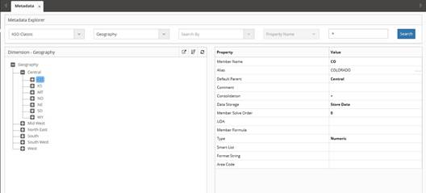
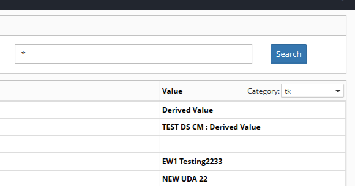
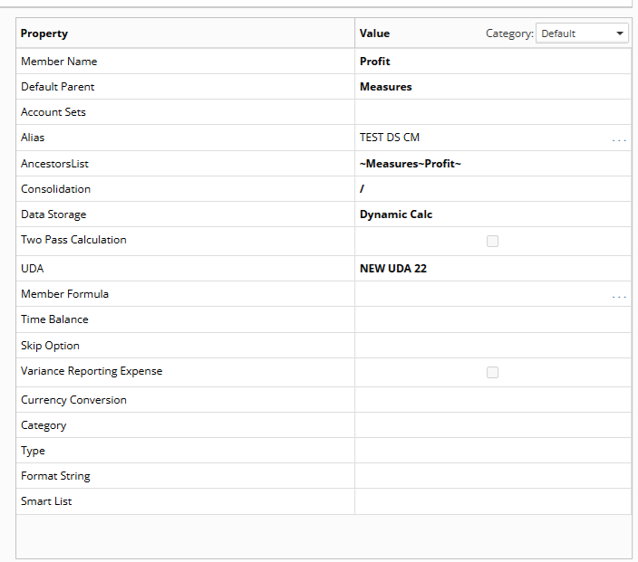
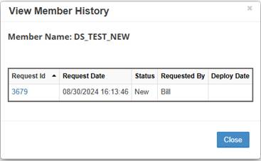

# Metadata Explorer

The **Metadata Explorer** provides powerful tools for visualizing and analyzing your EPMware metadata structure. Display hierarchical metadata by selecting an **Application** and **Dimension** from dropdown lists to navigate your dimension hierarchies with real-time status indicators.

A hierarchy is displayed by selecting an **Application** and **Dimension** from the dropdown list. The members that display in the hierarchy will be color coded to display the current status of the member. A red font will denote a member that is pending **Deployment**, and black font will denote that the member is "live" in the target application.

Users can search for a **Member Name** and **Property Name** by selecting a value in the **Search By** dropdown list and entering the search criteria in the input box. Selecting a member in the hierarchy will display the member properties in the right **Property** pane.

 
*Metadata Explorer showing hierarchy with color-coded status indicators*

## Search Functionality

The **Metadata Explorer** includes powerful search capabilities for locating specific members and properties. Select a value in the **Search By** dropdown list and enter search criteria in the input box to locate specific **Member Names** or **Property Names**. Selecting a member in the hierarchy will display the member properties in the right **Property** pane.

 
*Search functionality for finding specific members and properties*

!!! note
    Right click on a member and select **View History** to view the transaction history for the member.

## Member Properties

When a member is selected in the **Dimension Hierarchy**, the properties will be displayed in the right Property pane. The hierarchy displays the current status of each member with color coding - red font indicates members pending deployment, while black font shows members that are live in the target application.

 
*Property pane showing selected member details*

## Member History

Access detailed transaction history for any member by right-clicking and selecting **View History**. This displays the complete audit trail showing how and when the member was created or modified.

 
*Transaction history popup showing member creation and modification details*

!!! note
    If no request information is found for **View History**, the member was created from the initial application import.

## Export and Print Options

The Metadata Explorer includes export and print capabilities for offline reference and documentation purposes.

**To print the metadata view:**
Select the printer icon to generate a print-friendly version.

**To export data to a .csv file:**
Select the file icon to download the metadata information for external analysis.

---

## Related Topics

- [Creating Metadata Requests](../metadata-requests/index.md)
- [Property Management](../metadata-requests/index.md)
- [Dashboard](../dashboard/index.md)