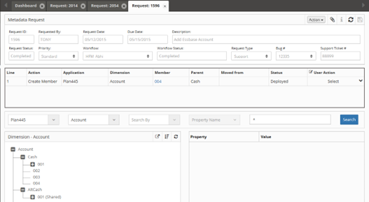

# Metadata Requests

A **Metadata Request** is initiated by selecting the **Create Request Metadata** from the Navigation Menu. The **Request ID**, **Requested By** and **Request Date** fields are automatically populated when the **Request** is created. Multiple request tabs can be opened at once, and a user is permitted to edit multiple tabs without saving them. If the "x" on the Request tab is selected and the Request is not saved, a warning message will appear.

Each Hierarchy action will create a record which is displayed in the **Line Item Grid** below the Request Header. A request may consist of a single line item or multiple line items. A user can click on the hyperlinked member on any row in the table to display the details in the Hierarchy and Properties pane.

After any Hierarchy action is executed the Hierarchy will be refreshed and the changes will be reflected in red to indicate the change is pending. If it is not reflected in the hierarchy, the hierarchy can be refreshed by selecting the Refresh Icon.

 
*Metadata Request interface showing header fields and line item grid*

!!! note
    A **Priority** and **Workflow** must be selected and saved before an Application and Dimension can be selected and displayed.

## Request Header Definitions

- **Request ID:** Unique system generated number that assigns a Request ID number to the request
- **Requested By:** The LDAP of the Requestor
- **Request Date:** Date the Request was created by the original Requestor
- **Due Date:** Due date assigned by the Requestor
- **Description:** A description of the Request entered by the Requestor
- **Request Status:** Identifies the status of the Request: *Open, Pending, Deployed, or Completed.*
- **Priority:** Assigns a priority to the Request and filters the Workflow drop down list.
- **Workflow:** Lists Workflows to which the Requestor has security access. The Security Groups assigned to the Workflow via **Tasks** will filter the Applications and Dimensions based on the Security Groups.
- **Workflow Status:** This is a read only field that identifies the Status of the Workflow: ***Pending Submission, Submitted, Pending Review, Pending Approval, Reviewed or Completed.***
- **UD1:** This is a user defined field defined by the Administrator.
- **UD2:** This is a user defined field defined by the Administrator.
- **UD3:** This is a user defined field defined by the Administrator.

 
*Request header showing required fields and workflow selection*

## User Actions

The Request interface provides several action buttons for managing requests throughout their lifecycle.

 
*Available user actions for request management*

- **Submit:** Submits a Request into Workflow
- **Cancel:** Cancels the Request. The Request will remain in the system and will be viewable from the Dashboard
- **Recall:** Starts the Workflow over from the beginning or recalls it to a prior stage
- **Delete:** Will delete the Request if never submitted or recalled
- **Bulk Upload:** Load multiple members by uploading a .csv file
- **Mass Approve:** Approves all line items in the grid for the specified User
- **Claim Request:** The current user will become the Requestor for this Request
- **Delete All Lines:** All lines in the Request will be deleted

## Bulk Upload

Load multiple members efficiently by uploading a .csv file using the **Bulk Upload** feature. The Bulk Template will contain the header information for the selected **Application** and **Dimension**.

 
*Bulk upload dialog for loading multiple members*

!!! note
    The Bulk Template will contain the header information for the selected **Application** and **Dimension**.

!!! note
    For OneStream bulk upload templates multiple values need to be concatenated with tilde character (~) and Vary by Dimension Member Names need to be prefixed with Semi Colon separator.

## To Create a Metadata Request

1. Select **Create Metadata Request** from the Navigation Menu.

2. Select a **Priority** and **Workflow** in the Header section.

3. Input or select remaining optional Header items:
   - Due Date
   - Description
   - User Defined Field 1
   - User Defined Field 2
   - User Defined Field 3

4. Attach a file to the Request *(Optional)*

5. **Save** the **Request.**

6. Select an **Application** and a **Dimension** to display the hierarchy.

7. Initiate a metadata change by right clicking on a member and selecting a member **Action** from the **Right Click Menu.** Or select **Bulk Upload** from the **Action Menu** to initiate a bulk upload.

8. Edit the member's **Properties** as needed.

The member's properties will remain in **Edit Mode** until the **Request** is submitted.

!!! note
    Priority and Workflow are the only required fields in the header section. All other fields are optional or system generated and can be selected or changed by the Requestor before the Request is completed.

## Right Click Member Actions

Right-click on any member in the hierarchy to access powerful member management actions. The context menu provides options for copying, moving, creating, and managing members within the dimension hierarchy.

 
*Right-click context menu showing available member actions*

- **Copy:** To copy a member from one parent to another.
- **Cut:** To move a member use Cut and then select the new parent member and Paste.
- **Paste As Child:** Pastes the member(s) as a child of the parent
- **Paste As Sibling:** Pastes the member(s) as a sibling of the adjacent member
- **Paste As Replace:** Pastes the members(s) and replaces the members if they exist.
- **Create Member As Child:** Create a new member as a child of the selected member
- **Create Member As Sibling:** Create a new member as a sibling of the selected member.
- **Insert Shared Member As Child:** Insert an existing member as a child from another hierarchy as a Shared Member in the selected location
- **Insert Shared Member As Sibling:** Insert an existing member as a sibling from another hierarchy as a Shared Member in the selected location
- **Insert Member As Child:** Insert a member from another application as a child of the selected member
- **Insert Member As Sibling:** Insert a member from another application as a sibling of the selected member
- **Clone Member As Child:** Creates a copy of the selected member and its properties as a child of the selected member
- **Remove Shared Member:** Remove a Shared Member from a hierarchy.
- **Delete Member:** This action deletes the member from *ALL* parents in the Dimension.
- **Rename Member:** Renames the member
- **Edit Properties:** Edit an existing member's properties.
- **Reorder Children:** Sorts the children of the selected parent member
- **View History:** View the history of how a member was created.

!!! note
    If no request information is found for **View History**, the member was created from the initial application import.

## To Add an Existing Member as a Shared Member

1. Right click on the parent member that the Shared Member will be added to and select **Insert Shared Member**.

2. Select the **Member** to be shared from the left pane and push it to the right pane using the arrow icon.

3. Select **Save**

 
*Dialog for adding existing members as shared members*

!!! note
    The Alias property for Shared members is linked to primary member and can't be managed separately.

## To Reorder Children

1. Right click on the parent member to be reordered and select **Reorder Children**.

2. Reorder Members by:
   - Drag members
   - Edit order number in the Order column
   - Click the Up or Down arrows

3. Select **Save**

 
*Interface for reordering child members*

## Property Pane

When a member is selected in the **Dimension Hierarchy** the properties will be displayed in the right Property pane. Right click on the member and select **Edit Properties** to edit the properties. The Property Pane will switch to edit mode which enables editing of the properties for that member.

Once the user has completed editing one or multiple properties, select the save icon in the property pane header to commit the changes to the database. Once this commit is made to a member, the change will appear in the **Line Item Grid**. Click the **Property Change icon** to view the **Prior Value** and **New Value** for the property. The changes are also viewable in the Activity Log.

If the member is already locked by another active request a message will popup to indicate that the member is locked for editing.

 
*Property pane showing required fields with yellow background*

!!! note
    Members that have an active change request are displayed in red in the hierarchy.

!!! warning
    If properties are associated with other dimensions, a **pending member** may be selected, but only if it is pending from the same request.

!!! note
    When the Member is in Edit mode, **drop down lists** and **input boxes** appear for the properties. Required properties have a yellow background and an * in the property Name.

## Line Item Grid

The **Line Item Grid** will display a summary of all the line items created or edited for the current **Request**. The grid will update automatically when an action is selected using the **Right Click Member Actions**. When a Dimension or Property is mapped to another application, an additional line will automatically be created for each mapped Application.

Search for an individual line by inputting any text or number into Smart search. Click the expand arrows to expand the grid for a full page view of the grid.

 
*Line item grid showing request details and user actions*

**User Action Column**

- **Approve:** Approves the line item.
- **Reject:** Rejects the line item.
- **Cancel:** Cancels the line item. This option is only available after the Request has been submitted. Cancel will **not** remove the line item since it has already entered workflow and an audit trail must be maintained.
- **Delete:** Deletes the line item. A line item can only be deleted if the request has **not** been submitted to **Workflow**.

A **Confirmation Popup** appears to verify all **User Column Actions.**

 
*Confirmation dialog for user actions*

!!! note
    The hyperlink in the **Member Column** can be clicked to drill down and display the member in the Hierarchy.

**Line Items with Multiple Members:** The following **Right Click Hierarchy Actions** may create **Line Items** in the grid which contains multiple members:

- Move Member (Cut and Paste)
- Insert as Shared
- Remove Member
- Delete Member

If there are multiple members for a line item, the **Member Column** will contain the first member name of the group and [...] indicating that the line item has multiple members.

For example, 12076 [...]. The **User Action** column displays a popup notifying the user that a selected action will create multiple line items.

## User Comments

A comment can be added to the Request by clicking the User Comments icon on the tool bar. A comment popup will appear, select the "+" icon to add a comment and then click the OK button.

 
*User comments icon and interface*

 
*Comments dialog for adding user notes*

## Activity Log

As the request proceeds through the Workflow approval process each step will be logged in the request **Activity Log** section. Notes can also be added to the **Activity Log**. Each note is prefixed with the User's LDAP and a timestamp. To add a note click on the Edit icon above the Activity Log section and the **Activity Log Notes** popup appears.

 
*Activity Log showing workflow progress and notes*

---

## Related Topics

- [Dashboard](../dashboard/index.md)
- [Deployment Monitoring](../deployment/index.md)