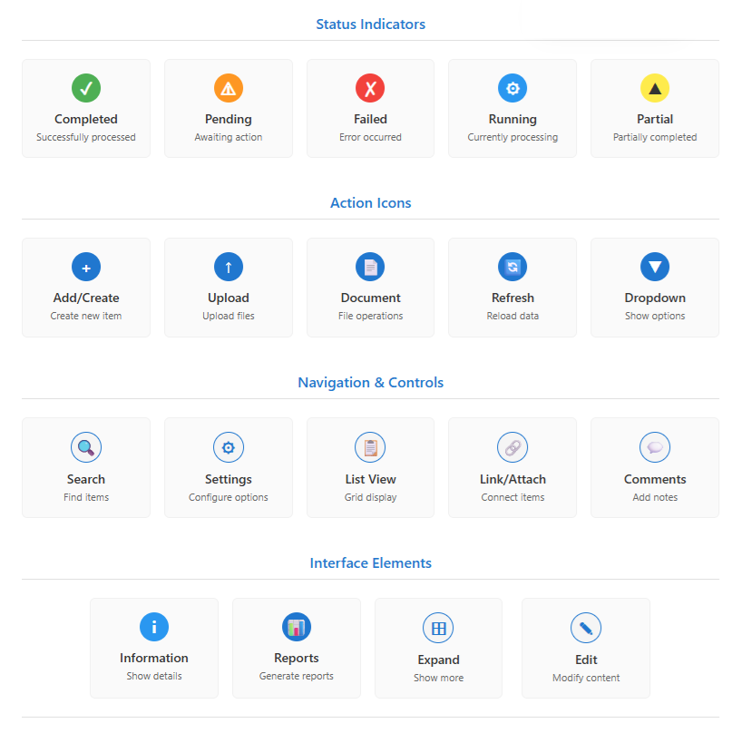

# Reference

This **Reference** section provides comprehensive definitions, quick reference guides, and visual indicators used throughout the EPMware system. Use this section to quickly look up field definitions, understand status indicators, and learn keyboard shortcuts for efficient navigation and operation.

The reference materials are organized into logical sections covering field definitions from request headers, status icons used throughout the system, and keyboard shortcuts for power users who want to navigate EPMware more efficiently.

## Field Glossary

Comprehensive definitions of all fields and terms used throughout the EPMware system, organized by functional area.

### Request Header Fields

- **Request ID:** Unique system generated number that assigns a Request ID number to the request
- **Requested By:** The LDAP of the Requestor
- **Request Date:** Date the Request was created by the original Requestor
- **Due Date:** Due date assigned by the Requestor
- **Description:** A description of the Request entered by the Requestor
- **Request Status:** Identifies the status of the Request: *Open, Pending, Deployed, or Completed*
- **Priority:** Assigns a priority to the Request and filters the Workflow drop down list
- **Workflow:** Lists Workflows to which the Requestor has security access. The Security Groups assigned to the Workflow via **Tasks** will filter the Applications and Dimensions based on the Security Groups
- **Workflow Status:** This is a read only field that identifies the Status of the Workflow: ***Pending Submission, Submitted, Pending Review, Pending Approval, Reviewed or Completed***
- **UD1:** This is a user defined field defined by the Administrator
- **UD2:** This is a user defined field defined by the Administrator  
- **UD3:** This is a user defined field defined by the Administrator

### Deployment Fields

- **Deployment ID:** Unique ID assigned to the Deployment
- **Name:** Name of Deployment as defined on Manager Tab
- **Application:** Application being deployed
- **Start Time:** The date and time that the Deployment instance began running
- **End Time:** The date and time that the Deployment instance completed
- **Status:** Will display either **Running** or **Completed**
- **Message:** Deployment progress messages
- **Files:** Click to download the deployment files
- **Log:** Will display the log file pertaining to this deployment instance

### Workflow Terminology

- **Stage:** A phase in the workflow process (Review, Approval, Validation, Deployment)
- **Task:** Individual actions within a workflow stage
- **Approver:** User authorized to approve requests at a specific stage
- **Reviewer:** User authorized to review and validate requests
- **Escalation:** Process of moving stalled requests to higher authority
- **Recall:** Action to return a request to a previous workflow stage

### Application Terms

- **Dimension:** Organizational structure for metadata (Account, Entity, Product, etc.)
- **Hierarchy:** Tree structure showing parent-child relationships of members
- **Member:** Individual element within a dimension (specific account, entity, product)
- **Property:** Attribute or characteristic of a member (alias, description, data type)
- **Shared Member:** Member that exists in multiple locations within the same dimension
- **Primary Member:** Original location of a shared member
- **Parent Member:** Member that has children in the hierarchy
- **Child Member:** Member that reports to a parent in the hierarchy
- **Sibling Members:** Members at the same level under the same parent

## Status Icons

Visual indicators used throughout EPMware to show the current state of requests, deployments, and system processes.

 
*Complete set of status icons used throughout EPMware*

### Request Status Icons

 **Completed** - Request has been successfully processed and deployed

 **Pending** - Request is waiting for action (review, approval, or deployment)

 **Failed** - Request has encountered an error and requires intervention

 **Running** - Request is currently being processed

 **Partial** - Some items completed successfully, others failed

### Member Status Indicators

- **Red Font:** Members pending deployment (changes not yet live)
- **Black Font:** Members that are "live" in the target application
- **Yellow Background:** Required fields in edit mode
- **Asterisk (*):** Indicates required property fields

### Workflow Status Indicators

- **Pending Submission:** Request created but not yet submitted to workflow
- **Submitted:** Request entered into workflow process
- **Pending Review:** Request awaiting reviewer action
- **Pending Approval:** Request awaiting approver action  
- **Reviewed:** Review stage completed successfully
- **Approved:** Approval stage completed successfully
- **Validated:** Validation stage completed successfully
- **Deployed:** Request successfully deployed to target systems
- **Completed:** All workflow stages finished successfully

## Keyboard Shortcuts

Efficient keyboard shortcuts for navigating and operating EPMware more quickly.

### Navigation Shortcuts

| Shortcut | Action | Context |
|----------|--------|---------|
| **Ctrl + N** | Create New Request | Request interface |
| **Ctrl + S** | Save Current Request | Request editing |
| **Ctrl + F** | Open Search | Any grid or list |
| **F5** | Refresh Current View | Any interface |
| **Escape** | Close Dialog/Cancel Action | Dialog boxes |
| **Enter** | Confirm Action | Dialog boxes |
| **Tab** | Move to Next Field | Forms and properties |
| **Shift + Tab** | Move to Previous Field | Forms and properties |

### Grid Navigation

| Shortcut | Action | Context |
|----------|--------|---------|
| **Arrow Keys** | Navigate Grid Cells | Any grid |
| **Page Up/Down** | Scroll Grid Pages | Large grids |
| **Home** | Go to First Column | Grid navigation |
| **End** | Go to Last Column | Grid navigation |
| **Ctrl + Home** | Go to First Row | Grid navigation |
| **Ctrl + End** | Go to Last Row | Grid navigation |
| **Space** | Select/Deselect Row | Multi-select grids |

### Hierarchy Navigation

| Shortcut | Action | Context |
|----------|--------|---------|
| **+** or **→** | Expand Node | Hierarchy trees |
| **-** or **←** | Collapse Node | Hierarchy trees |
| **↑↓** | Navigate Members | Hierarchy selection |
| **Ctrl + A** | Select All | Multi-select operations |
| **Delete** | Delete Selected | Member management |
| **F2** | Rename Member | Member editing |

### Right-Click Menu Shortcuts

| Shortcut | Action | Context |
|----------|--------|---------|
| **Ctrl + C** | Copy Member | Hierarchy management |
| **Ctrl + X** | Cut Member | Hierarchy management |
| **Ctrl + V** | Paste Member | Hierarchy management |
| **Ctrl + Z** | Undo Last Action | Property editing |
| **Ctrl + Y** | Redo Action | Property editing |

### Report Generation

| Shortcut | Action | Context |
|----------|--------|---------|
| **Ctrl + P** | Print Report | Report viewing |
| **Ctrl + E** | Export Report | Report generation |
| **Ctrl + R** | Run/Generate Report | Report interface |

## Quick Reference Tables

### Request Priorities

| Priority | Description | Workflow Impact |
|----------|-------------|-----------------|
| **High** | Urgent requests requiring immediate attention | Expedited approval process |
| **Medium** | Standard business requests | Normal approval timeline |
| **Low** | Non-critical requests | Extended approval timeline acceptable |

### Export Formats

| Format | Best Used For | File Extension |
|--------|---------------|----------------|
| **Excel** | Data analysis and manipulation | .xlsx |
| **PDF** | Documentation and sharing | .pdf |
| **CSV** | Data import and integration | .csv |

### Common Error Messages

| Error | Cause | Resolution |
|-------|-------|------------|
| "Member is locked" | Another user editing member | Wait or contact administrator |
| "Invalid property value" | Data doesn't meet validation rules | Check property requirements |
| "Insufficient permissions" | User lacks required access | Contact administrator for access |
| "Deployment failed" | Target system unavailable | Check system status and retry |

## System Limits

### Request Limits

- **Maximum line items per request:** 10,000
- **Maximum bulk upload size:** 50 MB
- **Maximum comment length:** 4,000 characters
- **Maximum description length:** 1,000 characters

### Performance Guidelines

- **Recommended batch size for bulk operations:** 500-1,000 items
- **Maximum concurrent deployments:** 5 per application
- **Report timeout period:** 30 minutes
- **Session timeout:** 8 hours of inactivity

---

## Related Topics

- [Dashboard](../dashboard/index.md)
- [Metadata Requests](../metadata-requests/index.md)
- [Metadata Explorer](../metadata-explorer/index.md)
- [Deployment](../deployment/index.md)
- [Reports](../reports/index.md)