# Reports

**Audit Reports** is an interactive report generator which allows users to pick a **Report Group** and run an **Audit Report** from that Group. Reports are generated in 3 user selectable formats: **Excel, .PDF** or **CSV**. EPMware maintains a complete audit trail of all transactions from request to deployment, and every transaction can be queried using reports included in the Audit module.

The Reports module provides comprehensive reporting capabilities across all aspects of the EPMware system, from metadata analysis to security auditing, request tracking, and deployment monitoring. Users can generate reports on demand and export them in multiple formats for offline analysis and documentation.

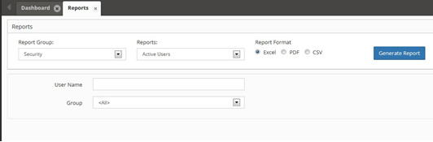 
*Reports interface showing report groups and generation options*

## Report Groups

EPMware organizes reports into logical groups for easy navigation and selection:

- **Admin** - Administrative reports for system management
- **Analytics** - Statistical and analytical reports  
- **Configuration** - System and application configuration reports
- **Deployment** - Deployment status and history reports
- **ERP Import** - Enterprise resource planning import reports
- **Exports** - Data export and extraction reports
- **Security** - User access and security reports
- **Metadata** - Comprehensive metadata analysis reports
- **Request** - Metadata request workflow reports
- **Workflow** - Workflow process and approval reports

## Report Export Formats

The **Reports** can be exported in the following formats:

- **Excel** - Full-featured spreadsheet format with formatting
- **.PDF** - Print-ready document format for sharing and archiving  
- **.CSV** - Comma-separated values for data analysis and import

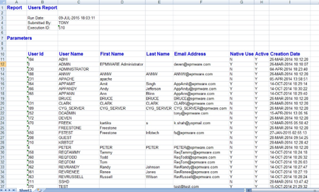 
*Report generation interface with format selection and parameters*

## To Generate a Report

1. Select **Audit Reports** from the Navigation Menu

2. Select a **Report Group**

3. Select a **Report**

4. Select a Report **Format**

5. Input additional parameters if required

6. Click **Generate Report**

7. Click **Save** to save the Report

## Metadata Reports

Comprehensive metadata analysis and documentation reports covering all aspects of your dimensional structures and hierarchies.

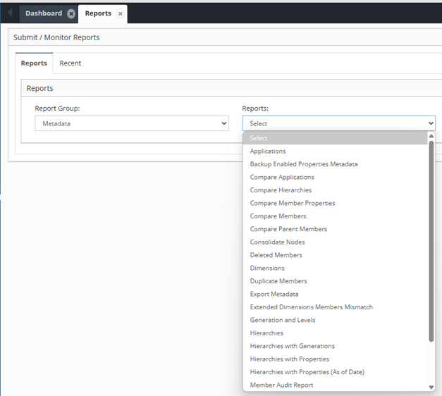 
*Metadata reports showing dimensional analysis options*

**Available Metadata Reports:**
- Applications
- Backup Enabled Properties Metadata  
- Compare Applications
- Compare Hierarchies
- Compare Member Properties
- Compare Members
- Compare Parent Members
- Consolidate Nodes
- Deleted Members
- Dimensions
- Duplicate Members
- Export Metadata
- Extended Dimensions Members Mismatch
- Generation and Levels
- Hierarchies
- Hierarchies with Generations
- Hierarchies with Properties
- Hierarchies with Properties (As of Date)
- Member Audit Report

## Security Reports

User access control and security administration reports for monitoring system security and user permissions.

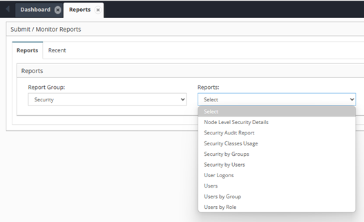 
*Security reports interface showing user and access control options*

**Available Security Reports:**
- Node Level Security Details
- Security Audit Report
- Security Classes Usage
- Security by Groups
- Security by Users
- User Logons
- Users
- Users by Group
- Users by Role

## Request Reports

Comprehensive tracking and analysis of metadata request workflows and approval processes.

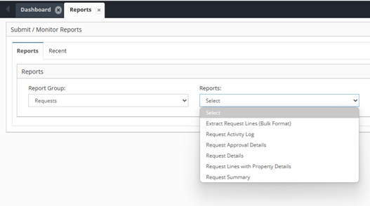 
*Request reports showing workflow and approval tracking options*

**Available Request Reports:**
- Extract Request Lines (Bulk Format)
- Request Activity Log
- Request Approval Details
- Request Details
- Request Lines with Property Details
- Request Summary

## Admin Reports

Administrative reports for system monitoring, maintenance, and operational oversight.

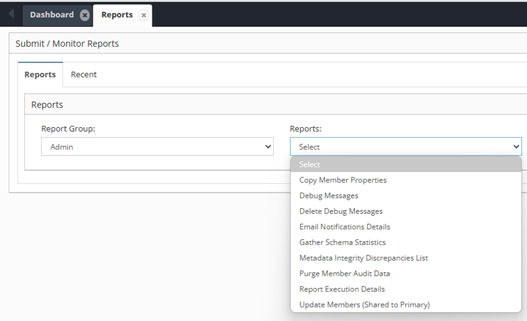 
*Admin reports interface showing system administration options*

**Available Admin Reports:**
- Copy Member Properties
- Debug Messages
- Delete Debug Messages
- Email Notifications Details
- Gather Schema Statistics
- Metadata Integrity Discrepancies List
- Purge Member Audit Data
- Report Execution Details
- Updated Members (Shared to Primary)

## Analytics Reports

Statistical analysis and performance metrics for system usage and operational insights.

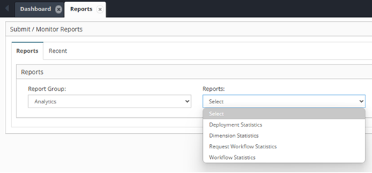 
*Analytics reports showing statistical analysis options*

**Available Analytics Reports:**
- Deployment Statistics
- Dimension Statistics  
- Request Workflow Statistics
- Workflow Statistics

## Configuration Reports

System configuration documentation and settings analysis across all EPMware components.

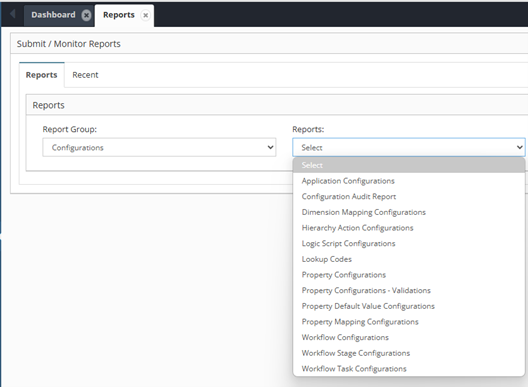 
*Configuration reports showing system setup and settings analysis*

**Available Configuration Reports:**
- Application Configurations
- Configuration Audit Report
- Dimension Mapping Configurations
- Hierarchy Action Configurations
- Logic Script Configurations
- Lookup Codes
- Property Configurations
- Property Configurations - Validations
- Property Default Value Configurations
- Property Mapping Configurations
- Workflow Configurations
- Workflow Stage Configurations
- Workflow Task Configurations

## Deployment Reports

Deployment tracking, status monitoring, and historical analysis of metadata deployments.

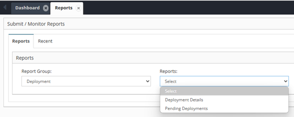 
*Deployment reports showing deployment tracking and analysis options*

**Available Deployment Reports:**
- Deployment Details
- Pending Deployments

## ERP Import Reports

Enterprise resource planning integration reports for monitoring data import processes and validation.

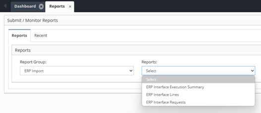 
*ERP import reports showing integration and data validation options*

**Available ERP Import Reports:**
- ERP Interface Execution Summary
- ERP Interface Lines
- ERP Interface Requests

## Export Reports

Data extraction and export process reports for monitoring bulk data operations and file generation.

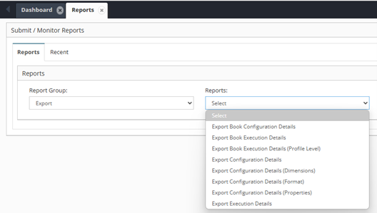 
*Export reports showing data extraction and bulk operation options*

**Available Export Reports:**
- Export Book Configuration Details
- Export Book Execution Details
- Export Book Execution Details (Profile Level)
- Export Configuration Details
- Export Configuration Details (Dimensions)
- Export Configuration Details (Format)
- Export Configuration Details (Properties)
- Export Execution Details

## Report Parameters

Many reports support additional parameters to filter and customize the output:

- **Date Ranges** - Filter reports by specific time periods
- **Applications** - Limit reports to specific applications
- **Dimensions** - Focus on particular dimensional structures  
- **Users** - Filter by specific user activities
- **Request Status** - Filter by workflow status
- **Custom Filters** - Additional criteria based on report type

## Scheduling and Automation

Reports can be configured for:

- **On-Demand Generation** - Run reports immediately as needed
- **Scheduled Execution** - Automate report generation at specific times
- **Email Distribution** - Automatically send reports to stakeholders
- **Archive Management** - Maintain historical report libraries

---

## Related Topics

- [Dashboard](../dashboard/index.md)
- [Metadata Requests](../metadata-requests/index.md)
- [Deployment](../deployment/index.md)
- [Reference](../reference/index.md)